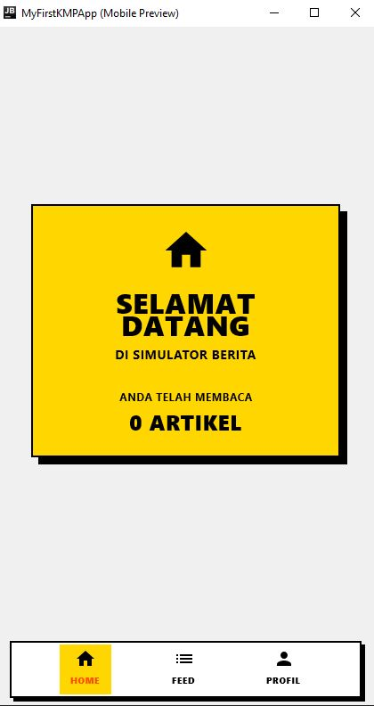
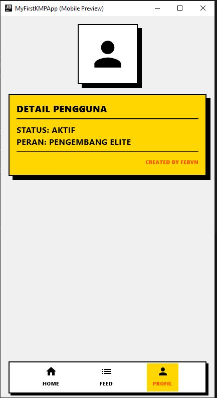

# RAW FEED: Brutalist Edition
### *Kotlin Multiplatform News Simulator*

[](https://kotlinlang.org/)
[](https://www.jetbrains.com/lp/compose-multiplatform/)
[](https://opensource.org/licenses/MIT)
[]()

**RAW FEED** adalah aplikasi simulator *news feed* berbasis **Kotlin Multiplatform (KMP)** dengan sentuhan desain **Brutalist Modern**. Aplikasi ini mensimulasikan aliran data berita real-time menggunakan teknologi Coroutines dan Flow, yang dikemas dalam antarmuka yang berani, kontras, dan responsif.

---

## Demo & Screenshots

Berikut adalah tampilan antarmuka **RAW FEED: Brutalist Edition**:

| **Feed Berita** | **Detail Profil** | **Home Screen** |
| :---: | :---: | :---: |
|  |  |  |

> *Aplikasi mendukung auto-scroll ke atas setiap kali berita baru masuk untuk memastikan Anda tidak ketinggalan informasi terbaru.*

---

## Tech Stack

Aplikasi ini dibangun menggunakan teknologi mutakhir dalam ekosistem Kotlin:

*   **Core:** [Kotlin Multiplatform (KMP)](https://kotlinlang.org/docs/multiplatform.html)
*   **UI Framework:** [Compose Multiplatform](https://www.jetbrains.com/lp/compose-multiplatform/) (Material 3)
*   **Asynchronous:** Kotlin Coroutines & Flow
*   **State Management:** StateFlow & SharedFlow
*   **Build Tool:** Gradle (Kotlin DSL)

---

## Fitur Utama

-   **Real-time Simulation:** Aliran berita otomatis setiap 2 detik menggunakan *Flow Builder*.
-   **Category Filtering:** Filter berita berdasarkan kategori (Tech, Sports, Business, Crypto, Politics).
-   **Auto-Scroll Focus:** Antarmuka secara otomatis melakukan *scroll* ke atas saat berita baru tiba.
-   **Error Handling:** Simulasi gangguan jaringan otomatis dengan manajemen *retry* via `.catch()` dan `.retry()`.
-   **Read Counter:** Pelacakan jumlah berita yang dibaca secara real-time.
-   **Brutalist UI:** Desain kaku dengan border tebal, warna kontras tinggi, dan bayangan blok (Raw UI).

---

## Struktur Project

Struktur folder utama aplikasi:

```text
├── composeApp/
│   ├── src/
│   │   ├── commonMain/         # Logika Utama (News Feed, ViewModel, UI)
│   │   │   └── kotlin/.../     
│   │   │       ├── NewsFeed.kt # File Logika & UI Terpadu
│   │   │       └── App.kt      # Root App
│   │   └── jvmMain/            # Entry point Desktop 
│   └── build.gradle.kts        # Konfigurasi Multiplatform
├── gradle/
└── gradlew.bat
```

---

## Instalasi & Penggunaan

### Prasyarat
- **JDK 11** atau lebih baru.
- **Android Studio** atau **IntelliJ IDEA** (direkomendasikan).

### Langkah-langkah Menjalankan
1. Clone repository:
   ```bash
   git clone https://github.com/Febvn/pemob_2.git
   ```
2. Masuk ke direktori:
   ```bash
   cd pemob_2
   ```
3. Jalankan aplikasi (Desktop):
   ```bash
   ./gradlew :composeApp:run
   ```

---

## Implementasi Tugas (Rubrik)

| Komponen | Implementasi Detail |
| :--- | :--- |
| **Flow Implementation** | Menggunakan `flow {}` builder di `NewsRepository` untuk emisi data otomatis. |
| **Operators** | Penggunaan `.map()`, `.filter()`, `.onEach()`, dan `.catch()` untuk transformasi data. |
| **StateFlow** | Pengelolaan state UI reaktif melalui `MutableStateFlow` di ViewModel. |
| **Coroutines** | Manajemen asinkron menggunakan `scope.launch`, `async`, dan `await` (simulasi latency). |
| **Bonus Features** | Implementasi **Unit Test** dan **Advanced Error Handling** (Retry Logic). |

---

## Author

**Febrian Valentino Nugroho**
*   **NIM:** 123140034
*   **Prodi:** Teknik Informatika
*   **GitHub:** [@Febvn](https://github.com/Febvn)

---

## License

Project ini dilisensikan di bawah **MIT License**. Silakan gunakan untuk keperluan pembelajaran.
