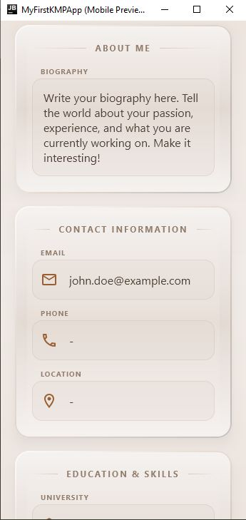
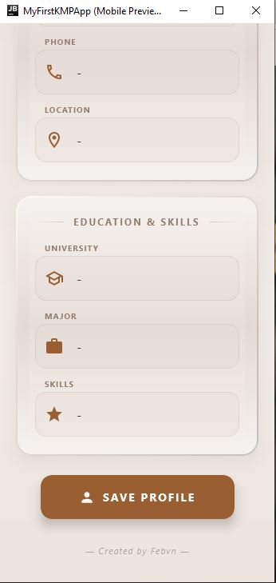
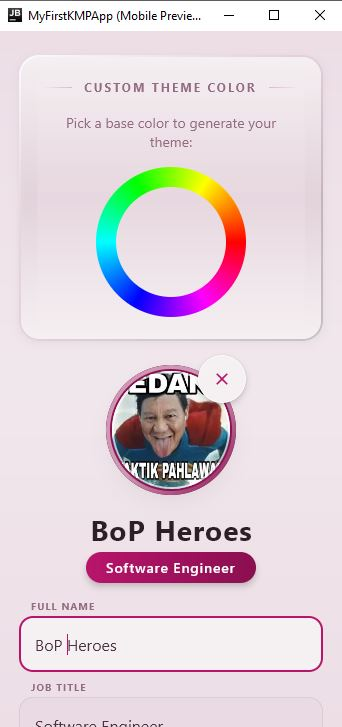

# My Profile App - Pemob_4 🚀 (MVVM Edition)

[](https://kotlinlang.org/)
[](https://www.jetbrains.com/lp/compose-multiplatform/)
[](https://developer.android.com/topic/architecture)

**My Profile App - Pemob_4** adalah evolusi besar dari versi sebelumnya. Aplikasi profil berbasis **Kotlin Multiplatform (KMP)** ini sekarang telah mengadopsi arsitektur **MVVM (Model-View-ViewModel)** yang matang, fitur **Dark Monochrome Mode**, dan sistem pengeditan profil yang jauh lebih reaktif menggunakan **StateFlow**.

---

## What's New in Pemob_4? ✨

*   **Professional MVVM Architecture:** Pemisahan tegas antara `ui/`, `viewmodel/`, dan `data/` (Clean Code).
*   **Dark Monochrome Mode:** Pencahayaan gelap dengan estetika monokrom (grayscale) yang elegan untuk tampilan premium.
*   **Refined Edit Interface:** Form pengeditan yang lebih rapi untuk Nama, Jabatan, dan Bio dengan transisi animasi yang mulus.
*   **StateFlow Management:** Sinkronisasi data yang lebih stabil dan reaktif menggunakan Kotlin Coroutines.
*   **Memory Optimized:** Konfigurasi Gradle yang telah dioptimalkan (768MB heap) untuk performa lebih ringan di perangkat dengan RAM terbatas.

---

## 📸 Gallery & Comparison (Pemob_3 vs Pemob_4)

Berikut adalah perbandingan evolusi aplikasi dari versi **Pemob_3** menuju **Pemob_4**:

### 🆕 Versi Terbaru (Pemob_4)
| Profile View (Main) | Edit Mode (Form) | Dark Monochrome Mode |
| :---: | :---: | :---: |
|  |  |  |

| Edit Bio Field | Saving Profile Progress |
| :---: | :---: |
|  |  |

### 🕰️ Versi Sebelumnya (Pemob_3 Overview)
Untuk mengenang perjalanan pengembangan, berikut adalah snapshot dari **Pemob_3**:
| Phase 3 - Part 1 | Phase 3 - Part 2 | Phase 3 - Part 3 |
| :---: | :---: | :---: |
|  |  |  |
|  |  |  |

---

## 🛠️ Struktur Project (MVVM)

Aplikasi telah diatur ulang ke dalam struktur paket yang modular:

```text
├── composeApp/
│   ├── src/commonMain/kotlin/com/example/myfirstkmpapp/
│   │   ├── data/           # Model data murni (ProfileData)
│   │   ├── viewmodel/      # Otak aplikasi (ViewModel & UI State)
│   │   ├── ui/             # Lapisan Tampilan
│   │   │   ├── components/ # Skeuorphic Cards, ColorWheel, dll
│   │   │   ├── screen/     # ProfileScreen (UI Utama)
│   │   │   └── theme/      # Palette Generator & Themes
│   │   ├── util/           # Image Pickers & Decoders
│   │   └── App.kt          # Root Entry Point
```

---

## 🚀 Instalasi & Run

1. **Clone Repository Terbaru:**
   ```bash
   git clone https://github.com/Febvn/Pemob_4.git
   ```
2. **Setup JAVA_HOME (PENTING):**
   Pastikan Anda menggunakan JDK 17+ (Rekomendasi: JBR dari Android Studio).
3. **Jalankan Aplikasi:**
   ```powershell
   ./gradlew :composeApp:run --no-daemon
   ```

---

## Author

**Febrian Valentino Nugroho**
*   **GitHub:** [@Febvn](https://github.com/Febvn)
*   **Class:** Pemob (Pemrograman Mobile)

---

## License

Project ini dilisensikan di bawah **MIT License**.
